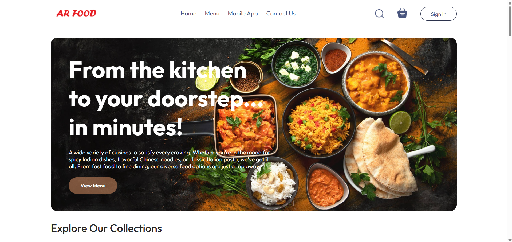

# AR Food

AR Food is a full-stack food ordering web application with an admin panel. Users can browse food items, add them to a cart, place orders, and track their order status. The admin panel enables management of food items and orders.

## Features

- Browse food menu by categories
- Add/remove items to/from cart
- Place orders with delivery details
- Online payment integration (Stripe)
- View and track past orders
- User authentication (register/login)
- Admin panel for managing food items and orders

## Folder Structure

```
AR Food/
│
├── admin/                   # Admin panel (React)
│   ├── public/
│   └── src/
│       ├── components/
│       ├── pages/
│       └── App.jsx
│
├── backEnd/                 # Backend API (Node.js/Express)
│   ├── controllers/
│   ├── models/
│   ├── routes/
│   ├── middleware/
│   ├── .env
│   └── server.js
│
├── frontEnd/                # User-facing frontend (React)
│   ├── public/
│   └── src/
│       ├── components/
│       ├── pages/
│       └── App.jsx
│
├── package.json
├── package-lock.json
├── README.md
└── screenshot.png           # Project screenshot
```
## Screenshot



## Tech Stack

- **Frontend:** React, Vite, Axios, React Router
- **Backend:** Node.js, Express, MongoDB, Mongoose, Stripe
- **Admin Panel:** React, Vite, Axios, React Router, React Toastify

## Getting Started

### Prerequisites

- Node.js (v18+ recommended)
- MongoDB (local or Atlas)
- npm

### Setup

#### 1. Backend

```sh
cd backEnd
npm install
# Set up your .env file with STRIPE_SECRET and JWT_SECRET
npm run server
```

#### 2. Frontend

```sh
cd frontEnd
npm install
npm run dev
```

#### 3. Admin Panel

```sh
cd admin
npm install
npm run dev
```

### Environment Variables

Create a `.env` file in `backEnd/` with:

```
STRIPE_SECRET=your_stripe_secret_key
JWT_SECRET=your_jwt_secret_key
```

## Usage

- Visit `http://localhost:5173` for the user app.
- Visit `http://localhost:5174` (or your admin Vite port) for the admin panel.
- Backend runs on `http://localhost:4000`.

## License

akash16-10